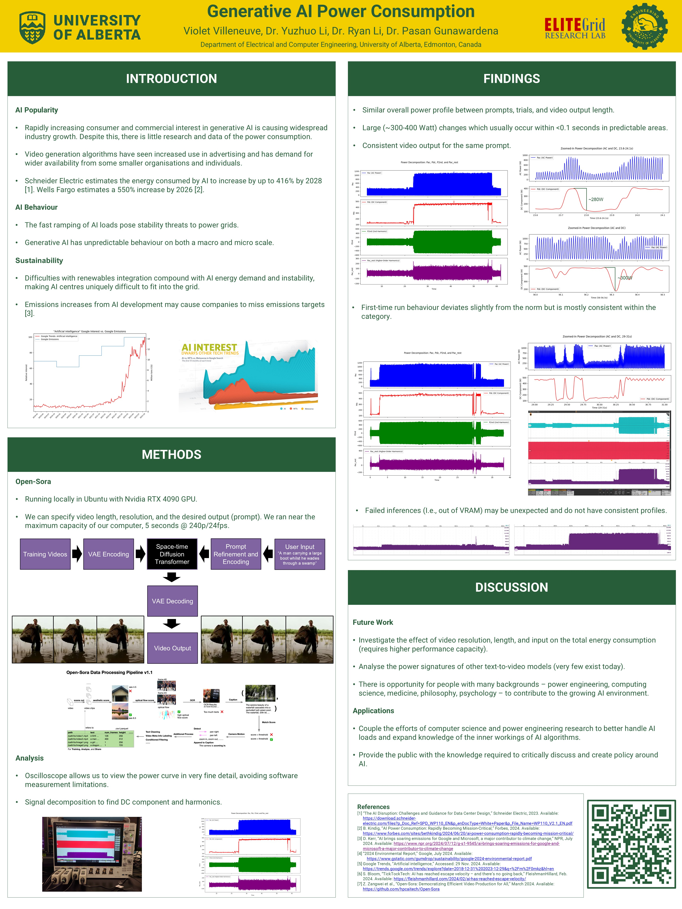

# Generative AI Power Consumption Based on Real-Time Data
I completed this project in the 2024 Fall semester. The goal was to conduct a basic investigation of the power signature of the video-generating AI model Open-Sora and share the results via poster. 

### Abstract
As competition in the tech space for generative AI increases, so too does the demand for power. Very large GPU clusters are required to support both training and use of generative AI, and the clusters only get larger and more power-hungry as the quantity of training and use increases. The power consumption patterns can be unpredictable, which in tandem with fast ramping and high consumption means that AI clusters present a unique challenge to the grid. We expect video generation models to have similar problems. This project was conducted to investigate the power consumption patterns of video generation AI models and gain insight into how large-scale systems function under similar conditions. Using an oscilloscope and probes, we measured the total power draw of a computer running Open-Sora from prompt input to video output. We were able to find a trend for the power consumption of different video lengths, and on a smaller scale noted patterns and chaotic behaviour of power consumption. Video generation AI is important to investigate as it has a significantly larger energy draw and has been experiencing increased use in corporate spaces. The information collected during this project can help give AI researchers and power engineers alike insight into AI algorithms, allowing for better optimisation, grid integration, and management of AI. 

### Video Samples

 

### Poster



### References
[1] “The AI Disruption: Challenges and Guidance for Data Center Design,” Schneider Electric, 2023. Available: https://download.schneider-electric.com/files?p_Doc_Ref=SPD_WP110_EN&p_enDocType=White+Paper&p_File_Name=WP110_V2.1_EN.pdf

[2] B. Kindig, “AI Power Consumption: Rapidly Becoming Mission-Critical,” Forbes, 2024. Available: https://www.forbes.com/sites/bethkindig/2024/06/20/ai-power-consumption-rapidly-becoming-mission-critical/

[3] D. Kerr, “AI brings soaring emissions for Google and Microsoft, a major contributor to climate change,” NPR, July 2024. Available: https://www.npr.org/2024/07/12/g-s1-9545/ai-brings-soaring-emissions-for-google-and-microsoft-a-major-contributor-to-climate-change

[4] “2024 Environmental Report,” Google, July 2024. Available: https://www.gstatic.com/gumdrop/sustainability/google-2024-environmental-report.pdf

[5] Google Trends, “Artificial intelligence,” Accessed: 29 Nov. 2024. Available: https://trends.google.com/trends/explore?date=2018-12-31%202023-12-29&q=%2Fm%2F0mkz&hl=en

[6] S. Bloom, “TickTockTech: AI has reached escape velocity – and there’s no going back,” FleishmanHillard, Feb. 2024. Available: https://fleishmanhillard.com/2024/02/ai-has-reached-escape-velocity/

[7] Z. Zangwei et al., “Open-Sora: Democratizing Efficient Video Production for All,” March 2024. Available: https://github.com/hpcaitech/Open-Sora

### Acknowledgements
I'd like to thank Dr. Yuzhuo Li for setting up this project and sharing knowledge of the technical aspects and poster design - check out the [GitHub page](https://github.com/chennnnnyize/LLM_Impact_Energy_Systems) for his research. The project was supported and arranged by Dr. Ryan Li of the [ELITE Grid Research Lab](https://sites.engineering.ualberta.ca/elitegridlab/) (provided lab space, oscilloscope, computer). This also would have been impossible without the [Open-Sora](https://github.com/hpcaitech/Open-Sora) developers.

### To cite this work/data
```bibtex
@misc{villeneuve2024generative,
  author       = {Villeneuve, Violet and Li, Yuzhuo and Li, Ryan and Gunawardena, Pasan},
  title        = {Generative AI Power Consumption},
  howpublished = {Poster presented at the Department of Electrical and Computer Engineering, University of Alberta, Edmonton, Canada},
  year         = {2024},
  note         = {Available at \url{https://github.com/violetrevolution/DRA2024}},
  organization = {University of Alberta, ELITEGrid Research Lab},
  month        = {December}
}
